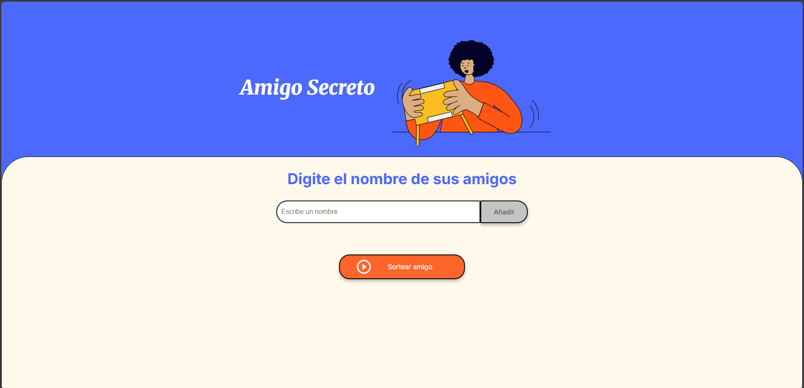

# 📑 Índice
- [🎁 Amigo Secreto](#-amigo-secreto)
- [📃 Funcionalidades](#-funcionalidades)
- [📂 Estructura del proyecto](#-estructura-del-proyecto)
- [🔧 Tecnologías utilizadas](#tecnologias-utilizadas)
- [📖 Instrucciones de uso](#-instrucciones-de-uso)
- [🌟 Agradecimientos](#-agradecimientos)

## 🎁 Amigo Secreto
Este es un juego sencillo para descubrir tu Amigo Secreto desarrollado con HTML, CSS y JavaScript, que permite agregar amigos a una lista, asegurando que los nombres sean válidos (sin números, ni duplicados) y luego seleccionar aleatoriamente uno como el “amigo secreto”.

Link del juego:(https://github.com/Afgankistan/challenge-amigo-secreto.git)

## 📃 Funcionalidades
- **Agregar amigos** evitando nombres vacíos, duplicados, con números y espacios al inicio y al final.
- **Lista dinámica** que muestra los amigos agregados.
- **Sorteo aleatorio** para elegir el amigo secreto.
- **Reinicio del juego automático después de 7 segundos** para limpiar la lista y comenzar de nuevo.

## 📂 Estructura del proyecto

```
┣📂assets              # Carpeta de imágenes 
 ┣ 📜 index.html       # Página principal
 ┣ 📜 style.css        # Estilos y diseño
 ┣ 📜 script.js        # Lógica del juego
 ┗ 📜 README.md        # Documentación del proyecto
```

## 🔧Tecnologías utilizadas

| Herramienta / Tecnología | Uso en el proyecto |
|--------------------------|--------------------|
| **HTML5**                | Estructura de la interfaz |
| **CSS3**                 | Diseño y estilos responsivos |
| **JavaScript**           | Lógica del juego y validaciones |
| **Visual Studio Code**   | Editor de código |

## 📋 Instrucciones de uso

1. Clonar o descargar este repositorio:
     ```
   git clone https://github.com/Afgankistan/challenge-amigo-secreto.git
    ```
2. Abrir el archivo index.html en cualquier navegador.

3. Escribir el nombre de un amigo en el campo de texto y presionar Añadir.

4. Una vez agregados al menos 2 amigos, presionar Sortear amigo.

5. El juego se reinicia automaticamente despues de 7 segundos.

## 🌟 Agradecimientos
**Oracle Next Education (ONE)** en colaboración con Alura LATAM por proporcionar la formación y los desafíos que hicieron posible este proyecto.

**Programa Oracle ONE:** Iniciativa educativa que democratiza el acceso a la tecnología en Latinoamérica.

**Alura LATAM:** Plataforma de educación tecnológica que brinda contenido de calidad y desafíos prácticos.
